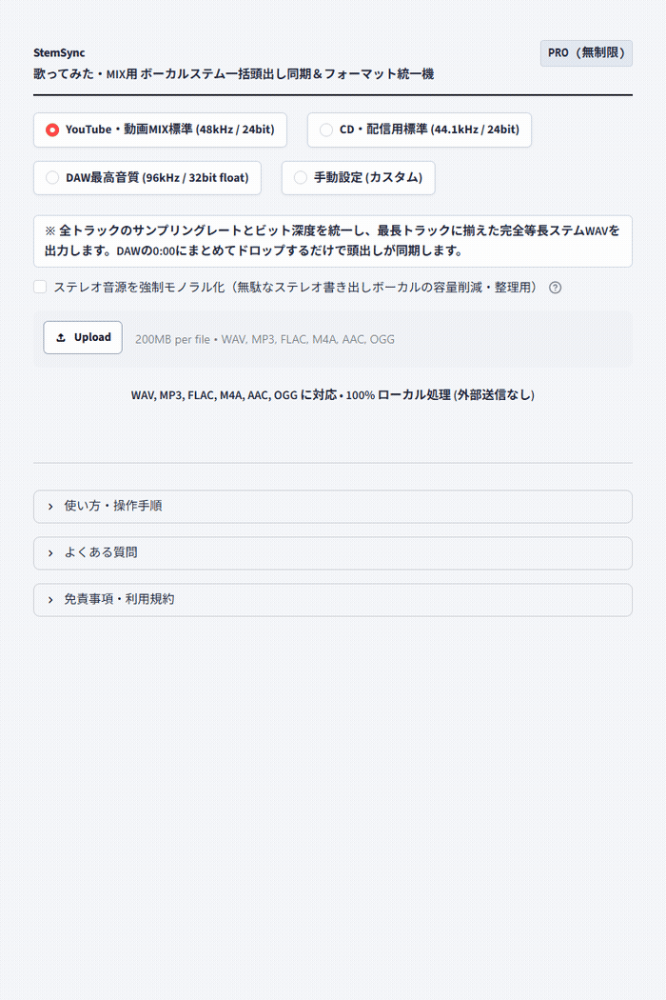

# 【Windows専用】StemSync GUI ｜ 歌ってみた・MIX用 ボーカルステム一括頭出し同期＆フォーマット統一機

> **「『オケの頭から書き出し直してもらえますか？』と頼む気まずさは、もう終わりにしよう。」**  
> ドラッグ＆ドロップ3秒。依頼者から届いたバラバラなサンプリングレート（44.1k/48k等）やビット深度を一括統一し、DAWの小節1（0:00）に並べるだけで全トラックが1ミリ秒もズレずに完全同期する「等長ステムWAV」を自動生成するWindows専用ポータブルGUIツールです。

## ■ 操作デモ（実際の動作）

---

## ■ こんな「ミックス前の下準備（プリプロ）」、毎案件30分もドブに捨てていませんか？

- **サンプリングレートが混在している恐怖**: 「オケは48kHzなのに、届いたボーカルは44.1kHz……」。そのままDAWに取り込んでピッチやタイミングが微妙に狂い、原因究明に時間を奪われる。
- **トラックごとに頭の位置や長さがバラバラ**: DAWに放り込んでも波形の位置が合わず、波形を限界まで拡大して「ここがサビの頭かな……」と手動で位置合わせ（頭出し）をする苦痛。
- **依頼者への「書き直しのお願い」が気まずい**: 「頭出しを揃えて書き直してください」と連絡しても、相手がDAWの扱いに不慣れで余計に時間がかかったり、関係性がぎくしゃくするストレス。
- **無駄にステレオで書き出されたボーカル素材**: 左右で全く同じ音なのにステレオWAVになっているせいで、ファイル容量が倍になり、DAWの貴重なトラック枠を無駄に圧迫する。

歌ってみたMIXや音楽制作において、最もワクワクするべきは「音作り・EQ・コンプ・空間系の演出」です。  
しかし、**本来クリエイティブであるはずの貴重な集中力を、「フォーマットの統一や手動の頭出しという単純作業」に奪われ続ける必要はありません。**

「StemSync GUI」は、MIX師・DTMerのプリプロ疲弊をゼロにするために生まれた、完全実務特化型のポータブルソフトウェアです。

---

## ■ なぜ、他の方法ではなく「StemSync」なのか？（4つの圧倒的理由）

### 1. DAWの「0:00」に放り込むだけで全トラックが完全同期（等長ステム化）
全トラックの中で最も長い音源（伴奏オケ等）の長さに合わせて、短いボーカル素材の末尾に完全な無音（ゼロパディング）を全自動で補足します。  
**すべてのファイルの「開始位置」と「全体の長さ」が完全に一致**するため、DAW（Cubase, Studio One, Logic, Pro Tools, Reaper, FL Studio等）のプロジェクト先頭（小節1 / 0:00）に全ファイルをまとめてドラッグ＆ドロップするだけで、1ミリ秒のズレもなく完璧に全トラックが同期します。

### 2. 原音を傷めない「高品質ポリフェーズ・リサンプリング」
`scipy.signal.resample_poly` による高度なポリフェーズ変換アルゴリズムを採用。  
44.1kHz ➔ 48kHz / 96kHz などのレート変換時に発生しがちなエイリアシングノイズや高域の劣化を極限まで抑え、原音のクリアな解像度を100%保ったまま一括統一します。

### 3. ステレオボーカルの「スマートモノラル化」スイッチ搭載
依頼者から「左右同じ音なのにステレオWAVで書き出されたボーカル素材」が届いた場合も安心です。  
画面上のチェックをONにして実行するだけで、自動的に真のモノラルWAV（1ch）に変換して出力。無駄なファイル容量を約半分に削減し、DAWのトラック数やPC負荷をスマートに節約できます（通常時はOFFのため、ステレオのインスト音源などはそのまま安全に維持されます）。

### 4. 面倒な環境構築ゼロ。解凍してダブルクリックですぐ起動
Pythonのインストールや面倒なコマンド入力、黒い画面（コマンドプロンプト）は一切不要です。  
配布ZIPを解凍し、`StemSync.vbs` をダブルクリックするだけで直感的な操作画面がスッと立ち上がります。USBメモリに入れて持ち運ぶことも可能です。

---

## ■ 作業時間は「30分」から「3秒」へ（使い方3ステップ）

1. **起動する**: フォルダ内の `StemSync.vbs` をダブルクリックします。
2. **放り込む**: 届いたステム音源（オケ、メインボーカル、ハモリ、コーラス等）をまとめてドラッグ＆ドロップします。
3. **選んで押す**: プリセットを選び、**「一括フォーマット統一＆等長ステム同期を実行」** をクリック。
   - **YouTube・動画MIX標準（推奨）**: `48kHz / 24-bit WAV`（動画・音楽制作デファクトスタンダード）
   - **CD・配信標準**: `44.1kHz / 24-bit WAV`（CD制作や従来のストリーミング規格）
   - **DAW最高音質**: `96kHz / 32-bit Float WAV`（ハイレゾ・プロクオリティ）
   - 処理完了後、**「📦 同期済みステムを一括保存 (ZIP)」** を押せば、DAWにすぐ貼れる等長WAVと文字化けしない測定レポートCSVが一瞬で手に入ります。

---

## ■ 動作環境・仕様

- **対応OS**: Windows 10 / 11 (64-bit)
- **インストール**: 不要（完全スタンドアロン動作・Embedded Python同梱）
- **対応入力フォーマット**: WAV, MP3, FLAC, OGG, M4A
- **出力フォーマット**: 指定レート（44.1k/48k/88.2k/96k） / 指定Bit深度（16bit/24bit/32bit Float）WAV
- **安全設計**: 完全オフライン動作（外部サーバー通信一切なし・未公開楽曲も安心）

---

## 🛒 ダウンロード・ご購入のご案内（BOOTH公式ストア）

まずは使い勝手をお手元のPCでお試しいただけるよう、無料Lite版と全機能対応の製品版をご用意しております。

👉 **[BOOTHでダウンロード・購入する](https://nichesoftmakers.booth.pm/items/8809381)**  
- **無料Lite版**: 0円（まずは基本機能や快適な操作感をお試しいただけます）
- **製品版**: **2,980円**（追加課金なしの買い切り・全機能無制限）

動画編集・音声処理・事務自動化など、全ツールの製品版やおトクな業務別バンドルパックも公式BOOTHストアにて公開中です。

---

## 💡 【ご購入・ご利用前に必ずご確認ください】初回起動時のWindows保護画面について

本ソフトは、パソコンのレジストリを変更せず解凍するだけで手軽に使える「ポータブル仕様（インストール不要）」として提供されているため、初回起動時にWindowsの画面に「**WindowsによってPCが保護されました**」という青い確認画面（SmartScreen）が表示される場合があります。

これは、パソコンのレジストリを変更せず手軽に使える未署名のツールに対して、**Windowsが形式上必ず表示する標準的な安全確認画面**です。  
ウイルス等の不正プログラムは一切含まれておらず、インターネット通信も行わない「完全ローカル・安全設計」となっております。

**【解除・起動手順（2クリックで完了します）】**
1. 画面内の **「詳細情報」** をクリックします。
2. 右下に現れる **「実行」** ボタンをクリックします。  
※一度実行すれば、次回以降はこの画面は表示されずスムーズに起動します。

---

## 📄 免責事項・利用規約（ライセンス区分）

- **個人利用を想定**: 本ソフトウェアは個人クリエイター・個人事業主等のPC業務効率化を目的として開発された個人利用専用ツールです。
- **シングルユーザー許諾**: ご購入者様本人（1名）のみ利用可能（ご自身が専属で使用する複数台PCでの利用は許可されます）。組織内での共有・複数名での共同利用・社内共有には対応しておりません。
- 本ソフトウェアは現状有姿（As-Is）で提供され、技術サポート・個別動作保証は行われません。詳細は同梱の `README.txt` をご確認ください。

---

## 📮 不具合報告・改善要望目安箱

本ツールに関する不具合の報告や「こんな機能が欲しい」というご要望は、以下の専用目安箱フォームよりお気軽にお寄せください（完全匿名・返信なし）：  
👉 **[ご意見・不具合報告フォーム ](https://forms.gle/2ib5A8EuhpaRs8QSA)**  
※原則として個別サポート・返信は行っておりませんが、いただいた内容はすべて開発者が目を通し、今後の機能改善やアップデートの参考とさせていただきます。
